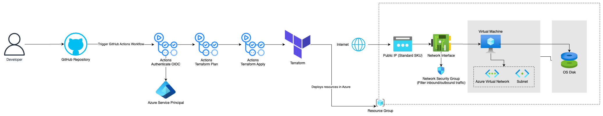
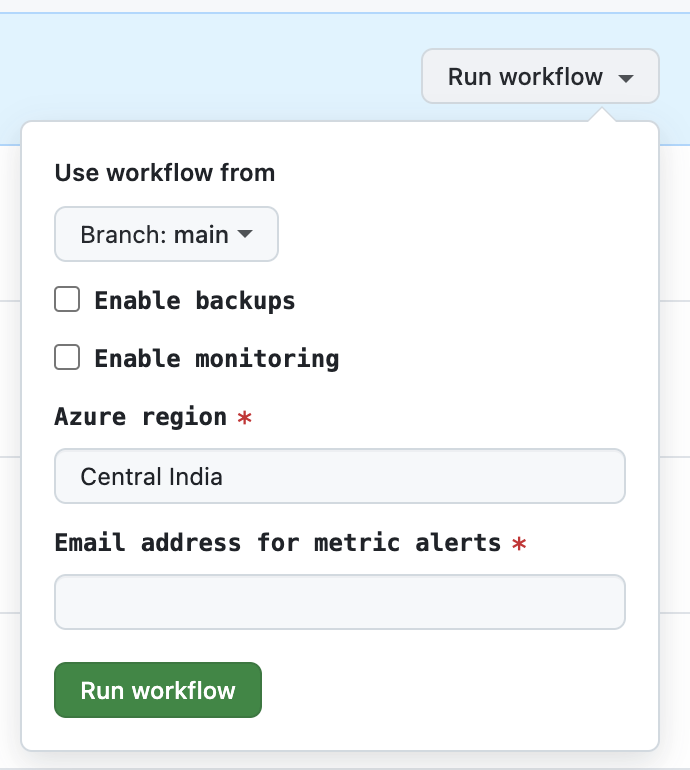

# OpenRemote Azure pipeline

This guide will help you set up everything to get started with the pipeline in GitHub Actions, Azure and Terraform.

## Architecture diagram



## Naming conventions
The [Abbreviation recommendations for Azure resources](https://learn.microsoft.com/en-us/azure/cloud-adoption-framework/ready/azure-best-practices/resource-abbreviations) have been used for naming resources in Terraform.

## Prerequisites

- Azure account
- [Terraform](https://developer.hashicorp.com/terraform/tutorials/aws-get-started/install-cli) installed
- [Azure CLI](https://learn.microsoft.com/en-us/cli/azure/install-azure-cli) installed
- [Git](https://git-scm.com/book/en/v2/Getting-Started-Installing-Git) installed
- GitHub account

## Step 1: Clone the Repository

```sh
git clone https://github.com/rubyfeller/openremote-azure-pipeline.git
cd openremote-azure-pipeline
cd terraform-azure
```

## Step 2: Configure Azure CLI

Log in to your Azure account using the Azure CLI:

```sh
az login
```

## Step 3: Set Up Terraform

Initialize Terraform:

```sh
terraform init
```

## Step 4: Configure OIDC Authentication

[Azure Provider: Authenticating using a Service Principal with Open ID Connect](https://registry.terraform.io/providers/hashicorp/azurerm/latest/docs/guides/service_principal_oidc)

## Step 5: Store Secrets and variables in GitHub Repository

Go to your GitHub repository settings and add the following secrets:

- `ARM_CLIENT_ID`: The application `clientId` from the Azure Entra (previously called Azure AD) App created in the previous step.
- `ARM_SUBSCRIPTION_ID`: Your Azure subscription ID.
- `ARM_TENANT_ID`: Your Azure tenant ID.
- `RESOURCE_GROUP_NAME`: Name of the Azure resource group that will be created
- `SSH_PUBLIC_KEY`: SSH key
- `SSH_SOURCE_IP`: IP address that's allowed to SSH into virtual machine
- `STORAGE_ACCOUNT`: Name of the Azure storage account that will be created (e.g. openremotestorage)
- `CONTAINER_NAME`: Name of the container that will be created for storing the Terraform state (e.g. tfstate)

The `TF_ACTIONS_WORKING_DIR` variable can be set in the `Repository variables`. It should specify the folder where your Terraform files are located. By default, it should point to `./terraform-azure`, as the path is relative to the `.github/workflows` folder.

## Step 6: Add terraform.tfvars file
Add a terraform.tfvars file locally, in which at least the following variables should be added:

```go
subscription_id     = ""
ssh_source_ip       = "0.0.0.0/32"
alert_email_address = ""
```

The other variables that are in `variables.tf` can also be added if you want to override the default values, for example to deploy in a different region.

## Step 7: Add state_override.tf
Add a state_override.tf file locally and add the following content:

```go
terraform {
  backend "local" {
  }
}
```

This configures Terraform to use a local backend for state mangement. It makes sure the remote state isn't affected.

## Step 8: Apply Terraform Configuration

Run the following command to apply the Terraform configuration:

```sh
terraform apply
```

This will deploy OpenRemote in Azure using the local configuration.

## Step 9: Deployment via GitHub Actions

In the GitHub repository, go to the 'Actions' tab and select the 'Deploy OpenRemote' flow.
In the top right corner, hit the 'Run workflow' button. Here you can enter the desired values and start the workflow, which will deploy OpenRemote to Azure:



## Conclusion

You have successfully set up the pipeline using GitHub Actions. You can now start building and deploying.

For more information, refer to the [Terraform Azure Provider documentation](https://registry.terraform.io/providers/hashicorp/azurerm/latest/docs) and the [GitHub Actions documentation](https://docs.github.com/en/actions).

## AWS setup comparison
Terraform's modular approach makes it easier to scale and manage resources compared to bash scripts and CloudFormation.

Terraform can manage both Azure and AWS resources, reducing the need for separate tooling and increasing consistency across cloud providers.

Features like `create_before_destroy` minimize downtime and simplify upgrades.

The downside is that it takes time to learn Terraform. It's also crucial to manage Terraform state files properly to avoid conflicts and data loss.

The current Terraform setup can be adapted for AWS by adding the [AWS Provider](https://registry.terraform.io/providers/hashicorp/aws/latest/docs) and creating the AWS Resources. The state files can be stored in for example S3.

## Recommendations
#### Custom images
It's recommended to create the VM from a custom image so it always has the correct configuration. It's also faster to deploy and easier to update the operating system and dependencies, since you don't need to SSH into the machine to do this.  The image can be created with for example [Packer](https://www.packer.io/). It's also created by HashiCorp and integrates well with the pipeline and has support for AWS, Azure, and GCP.

To update an image, the new image can replace the existing one in code.
The `create_before_destroy` lifecycle setting can be used to prevent any downtime: 
```go
  lifecycle {
    create_before_destroy = true
  }
```

#### Application health check
An [application health check](https://learn.microsoft.com/en-us/azure/virtual-machines/extensions/health-extension?tabs=rest-api) can currently only be added via the Rest API, Powershell, CLI or Azure Portal. Therefore it's not implemented. This could be solved by using the CLI in the pipeline, doing it manually via the portal or by using another tool for monitoring the application health.

#### Account provisioning
In the setup for AWS, multiple accounts are created for isolation. In Azure, an Entra tenant is used. The tenant can contain isolated subscriptions with its own billing, resource quotas, and management policies. Each environment could have it's own subscription (testing, staging, production).

Azure Management Groups, Azure Policy, and Role-Based Access Control (RBAC) can be used for enforcing policies. Currently, multiple subscriptions are not supported. It's recommended to adapt the pipeline so it can support multiple subscriptions.

#### Audit logging
The [Azure Activity Log](https://learn.microsoft.com/en-us/azure/azure-monitor/essentials/activity-log-insights) can be used to see who did what and when. For example when a resource is modified or a virtual machine is started.

The retention period for these logs is 90 days. It's therefore recommended to store the logs in Azure Log Analytics, a SIEM or Azure Storage account.

 #### State drift
It's important to handle everything via Terraform and not use the Azure portal.
If changes are made in the Azure Portal, Terraform is not aware of this and the state doesn't represent the actual situation, leading to inconcisenties.

A tool that detects state drift could be added to the pipeline, however if all changes are made via Terraform this isn't neccecary.