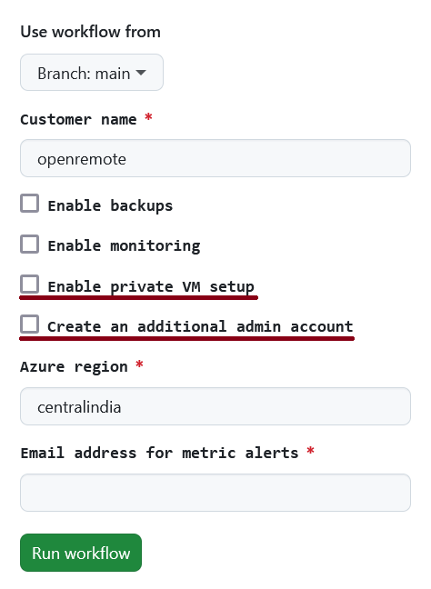
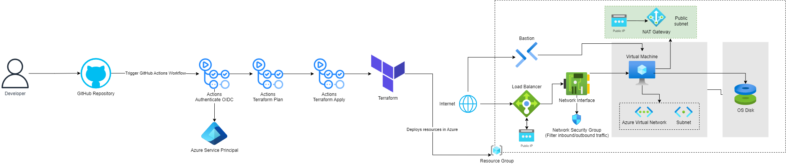

# OpenRemote Azure pipeline

This guide will help you set up everything to get started with the pipeline in GitHub Actions, Azure and Terraform.

## Architecture diagram


## Naming conventions
The [Abbreviation recommendations for Azure resources](https://learn.microsoft.com/en-us/azure/cloud-adoption-framework/ready/azure-best-practices/resource-abbreviations) have been used for naming resources in Terraform.

## Prerequisites

- Azure account
- [Terraform](https://developer.hashicorp.com/terraform/tutorials/aws-get-started/install-cli) installed
- [Azure CLI](https://learn.microsoft.com/en-us/cli/azure/install-azure-cli) installed
- [Git](https://git-scm.com/book/en/v2/Getting-Started-Installing-Git) installed
- GitHub account

## Step 1: Clone the repository

```sh
git clone https://github.com/rubyfeller/openremote-azure-pipeline.git
cd openremote-azure-pipeline
cd terraform-azure
```

## Step 2: Configure Azure CLI

Log in to your Azure account using the Azure CLI:

```sh
az login
```

## Step 3: Set up Terraform

Initialize Terraform:

```sh
terraform init
```

## Step 4: Configure OIDC authentication

[Azure Provider: Authenticating using a Service Principal with Open ID Connect](https://registry.terraform.io/providers/hashicorp/azurerm/latest/docs/guides/service_principal_oidc)

## Step 5: Add role assignment
Add the `Owner` and `User Access Administrator` roles to the service principal. 
See the [Microsoft documentation](https://learn.microsoft.com/en-us/azure/role-based-access-control/role-assignments-steps) on how to do this via the portal or CLI.

Make sure to set the 'Assign access to' to 'User, group, or service principal' and search for the service principal if it doesn't show automatically.

For 'What user can do', please select 'Allow user to assign all roles (highly privileged)'.

## Step 6: Add Graph API permissions
Go to Microsoft Entra ID and select `Enterprise applications`. Select the application. Click on `Permissions` and set the Microsoft Graph `Directory.Read.All` and `Directory.ReadWrite.All` permissions.

For more information, refer to the [Microsoft documentation](https://learn.microsoft.com/en-us/entra/identity/enterprise-apps/grant-admin-consent?pivots=portal).

## Step 7: Store secrets and variables in GitHub repository

Go to your GitHub repository settings and add the following secrets:

- `ARM_CLIENT_ID`: The application `clientId` from the Azure Entra (previously called Azure AD) App created in the previous step.
- `ARM_SUBSCRIPTION_ID`: Your Azure subscription ID.
- `ARM_TENANT_ID`: Your Azure tenant ID.
- `RESOURCE_GROUP_NAME`: Name of the Azure resource group that will be created.
- `SSH_PUBLIC_KEY`: SSH key.
- `SSH_SOURCE_IP`: IP address that's allowed to SSH into virtual machine.
- `STORAGE_ACCOUNT`: Name of the Azure storage account that will be created (e.g. openremotestorage).
- `CONTAINER_NAME`: Name of the container that will be created for storing the Terraform state (e.g. tfstate).
- `SERVICE_PRINCIPAL_OBJECT_ID`: Service Principal Object ID.

The `TF_ACTIONS_WORKING_DIR` variable can be set in the `Repository variables`. It should specify the folder where your Terraform files are located. By default, it should point to `./terraform-azure`, as the path is relative to the `.github/workflows` folder.

## Step 8: Add terraform.tfvars file
Add a terraform.tfvars file locally, in which at least the following variables should be added:

```go
subscription_id     = ""
ssh_source_ip       = "0.0.0.0/32"
alert_email_address = ""
```

The other variables that are in `variables.tf` can also be added if you want to override the default values, for example to deploy in a different region.

## Step 9: Add state_override.tf
Add a state_override.tf file locally and add the following content:

```go
terraform {
  backend "local" {
  }
}
```

This configures Terraform to use a local backend for state mangement. It makes sure the remote state isn't affected.

## Step 10: Apply Terraform configuration

Run the following command to apply the Terraform configuration:

```sh
terraform apply
```

This will deploy OpenRemote in Azure using the local configuration.

## Step 11: Deployment via GitHub Actions

In the GitHub repository, go to the 'Actions' tab and select the 'Deploy OpenRemote' flow.
In the top right corner, hit the 'Run workflow' button. Here you can enter the desired values and start the workflow, which will deploy OpenRemote to Azure:


## Conclusion

You have successfully set up the pipeline using GitHub Actions. You can now start building and deploying.

For more information, refer to the [Terraform Azure Provider documentation](https://registry.terraform.io/providers/hashicorp/azurerm/latest/docs) and the [GitHub Actions documentation](https://docs.github.com/en/actions).

## Additional Security Features

In the run workflow menu, you will find **two optional security features**:

- Enable private VM setup
- Create an additional admin account

These optional features enhance the security of your infrastructure. Primarily used to minimize potential risks within the Azure environment and the IoT platform, enabling these options will also **increase your Azure infrastructure costs**.


### Enable private VM setup

By default, the OpenRemotes IoT platform is deployed in a public subnet with a public IP address, potentially exposing it to security risks. Enabling the "Enable private VM setup" option significantly enhances security by deploying the platform within a private network, drastically reducing the attack surface. This option is highly recommended for production environments or when dealing with sensitive data.

This option modifies the architecture to include the following Azure resources:

- **Virtual Machine in a Private Subnet without Public IP:** This is the core of the security enhancement. By removing the direct public IP, the IoT platform is no longer directly accessible from the internet, mitigating a major vulnerability.
- **Load Balancer:**  The Load Balancer acts as the single point of entry for external traffic. It receives requests from the internet and redirects them to the private Virtual Machine. This allows users to access the platform without exposing the VM directly.
- **NAT Gateway:**  While the Virtual Machine has no public IP, it still needs internet access for proper application functionality. The NAT Gateway provides this outbound internet access in a secure and managed way.
- **Azure Bastion:** Instead of opening SSH ports directly to the internet, Azure Bastion provides a secure way to access the Virtual Machine's operating system for maintenance and troubleshooting. You can connect to the VM through the Azure Portal without exposing SSH ports publicly.

Architecture diagram with private VM setup:
 

### Create an additional admin account

To enhance security and follow the principle of least privilege, this option creates a dedicated administrator account, **strongly discouraging the use of the root account for day-to-day management**. Using the root account for all activities increases the risk if those credentials are compromised, potentially leading to significant damage to your Azure environment. This practice aligns with security best practices by limiting the potential impact of a security breach.

After the Terraform deployment completes, the following outputs will be provided:

- **Administrator email:** `admin@<your_azure_default_domain>.com`
- **Temporary Password:** `OpenRemote123!`

**Immediately after deployment, use these credentials to log in to the Azure Portal.** Upon your first login with this administrator account, you will be **asked to change the temporary password to a strong, unique password and to set up Multi-Factor Authentication within 14 days.** Enabling MFA is crucial for adding an extra layer of security and protecting your account even if your password is compromised.

This dedicated administrator account has the necessary permissions to manage your deployed infrastructure within the Azure Portal. **It is highly recommended that you use this account for all administrative tasks moving forward, reserving the root account exclusively for billing and critical, one-time administrative actions.**  Treat the root account credentials with extreme caution and store them securely.

## AWS setup comparison
Terraform's modular approach makes it easier to scale and manage resources compared to bash scripts and CloudFormation.

Terraform can manage both Azure and AWS resources, reducing the need for separate tooling and increasing consistency across cloud providers.

Features like `create_before_destroy` minimize downtime and simplify upgrades.

The downside is that it takes time to learn Terraform. It's also crucial to manage Terraform state files properly to avoid conflicts and data loss.

The current Terraform setup can be adapted for AWS by adding the [AWS Provider](https://registry.terraform.io/providers/hashicorp/aws/latest/docs) and creating the AWS Resources. The state files can be stored in for example S3.

## Recommendations
#### Custom images
It's recommended to create the VM from a custom image so it always has the correct configuration. It's also faster to deploy and easier to update the operating system and dependencies, since you don't need to SSH into the machine to do this.  The image can be created with for example [Packer](https://www.packer.io/). It's also created by HashiCorp and integrates well with the pipeline and has support for AWS, Azure, and GCP.

To update an image, the new image can replace the existing one in code.
The `create_before_destroy` lifecycle setting can be used to prevent any downtime: 
```go
  lifecycle {
    create_before_destroy = true
  }
```

#### Application health check
An [application health check](https://learn.microsoft.com/en-us/azure/virtual-machines/extensions/health-extension?tabs=rest-api) can currently only be added via the Rest API, Powershell, CLI or Azure Portal. Therefore it's not implemented. This could be solved by using the CLI in the pipeline, doing it manually via the portal or by using another tool for monitoring the application health.

#### Account provisioning
In the setup for AWS, multiple accounts are created for isolation. In Azure, an Entra tenant is used. The tenant can contain isolated subscriptions with its own billing, resource quotas, and management policies. Each environment could have it's own subscription (testing, staging, production).

Azure Management Groups, Azure Policy, and Role-Based Access Control (RBAC) can be used for enforcing policies. Currently, multiple subscriptions are not supported. It's recommended to adapt the pipeline so it can support multiple subscriptions.

#### Audit logging
The [Azure Activity Log](https://learn.microsoft.com/en-us/azure/azure-monitor/essentials/activity-log-insights) can be used to see who did what and when. For example when a resource is modified or a virtual machine is started. The Microsoft Entra Audit logs can be used to to see all events in Entra ID, such as what users were changed, if a service principal has been changed etc.

The retention period for the activity logs is 90 days. The retention period for Entra Audit logs are 30 days, unless you have an Entra Premium P1 or P2 subscription. Then it can be extended to a maxiumum of 2 years (730 days). It's therefore recommended to store the logs in Azure Log Analytics, a SIEM or Azure Storage account.

 #### State drift
It's important to handle everything via Terraform and not use the Azure portal.
If changes are made in the Azure Portal, Terraform is not aware of this and the state doesn't represent the actual situation, leading to inconcisenties.

A tool that detects state drift could be added to the pipeline, however if all changes are made via Terraform this isn't neccecary.